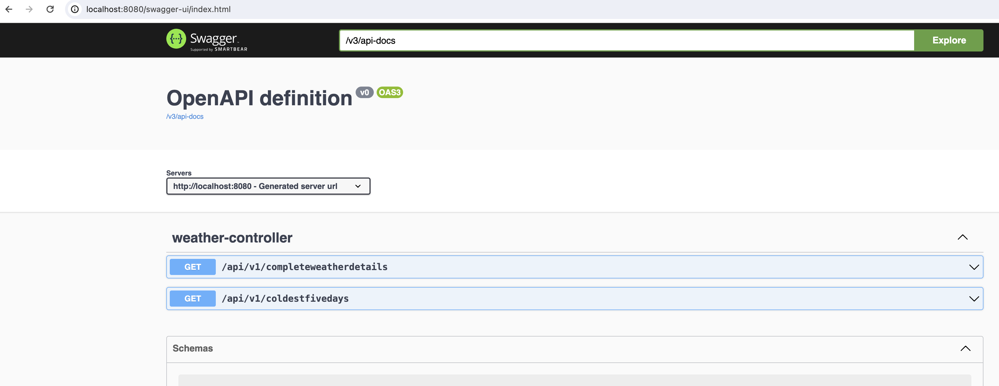

# OpenWeatherAssignment
The Application uses OpenWeatherAPI endpoints from the site [OpenWeatherOrg](https://openweathermap.org/api) and produces formatted and detailed JSON output.
This application also uses basic security authentication for accessing the REST API's

username: nik

password: nik

The JSON output consists of weather of a place with latitude and longitude details. (lat , lon should be an input from user who is using this API)

For example : http://{_yourLocalHost_}/api/v1/coldestfivedays?lat=49.895077&lon=-97.138451 produces ...

{

    "dayOfFive": 2,
    "dt": 1709920800,
    "date": "2024-03-08T18:00:00.000+00:00",
    "weatherInCelsius": -10.149999999999977,
    "weatherInFahrenheit": 13.73000000000004,
    "temp": {
    "day": 263.0,
    "min": 252.31,
    "max": 265.29,
    "night": 256.04,
    "eve": 261.14,
    "morn": 252.77
    },
    "feels_like": {
    "day": 259.3,
    "night": 252.23,
    "eve": 261.14,
    "morn": 252.77
    },
    "wind_speed": 2.18
}

The 'dayOfFive' field gives the coldest day in the next five days. Remaining fields are self-explanatory.
You can also use the Swagger Documentation included in this app.
After running the application in your local. Just access the link : http://localhost:8080/swagger-ui.html
You can access REST API's as below ...

